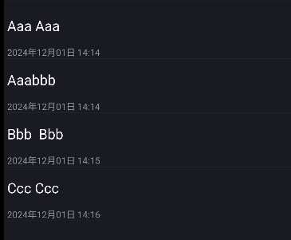
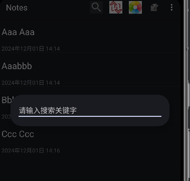
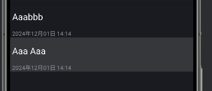
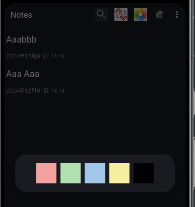
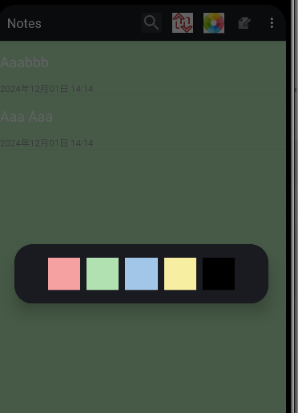
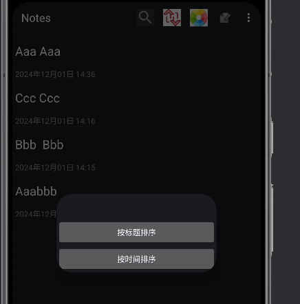
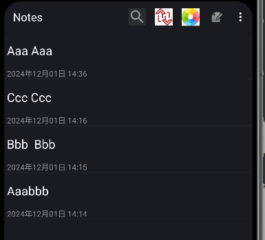
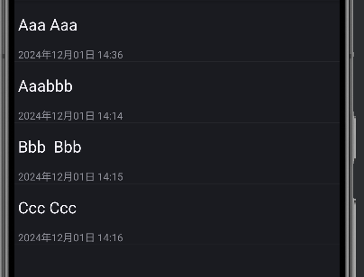

功能1：时间戳
 public boolean setViewValue(View view, Cursor cursor, int columnIndex) {
                if (columnIndex == 2) {
                    long dateLong = cursor.getLong(columnIndex);
                    Date date = new Date(dateLong);
                    SimpleDateFormat outputFormat = new SimpleDateFormat("yyyy年MM月dd日 HH:mm", Locale.getDefault());
                    String formattedDate = outputFormat.format(date);
                    ((TextView) view).setText(formattedDate);
                    return true;
                }
                return false;
            }
这个方法改变了时间戳的显示格式为"yyyy年MM月dd日 HH:mm"
private static final String[] PROJECTION = new String[]{
            NotePad.Notes._ID, // 0
            NotePad.Notes.COLUMN_NAME_TITLE,
            NotePad.Notes.COLUMN_NAME_MODIFICATION_DATE,// 1
    };设置修改时间为时间戳
    String[] dataColumns = {NotePad.Notes.COLUMN_NAME_TITLE, NotePad.Notes.COLUMN_NAME_MODIFICATION_DATE,};
        int[] viewIDs = {android.R.id.text1, R.id.text_modify_date};
        设置显示的data包括title和时间戳
    

功能2：搜索功能
在onCreateOptionsMenu中添加图标监听事件
MenuItem searchMenuItem = menu.findItem(R.id.menu_search);
        if (searchMenuItem != null) {
            searchMenuItem.setOnMenuItemClickListener(new MenuItem.OnMenuItemClickListener() {
                @Override
                public boolean onMenuItemClick(MenuItem item) {
                    showSearchDialog();
                    return true;
                }
            });
        }

private void showSearchDialog() {
        AlertDialog.Builder builder = new AlertDialog.Builder(this);
        LayoutInflater inflater = getLayoutInflater();
        View dialogView = inflater.inflate(R.layout.search_dialog, null);
        builder.setView(dialogView);
        mSearchDialog = builder.create();
        mSearchDialog.show();

        mSearchEditText = (EditText) mSearchDialog.findViewById(R.id.editText_search);
        if (mSearchEditText != null) {
            mSearchEditText.setOnEditorActionListener(new TextView.OnEditorActionListener() {
                @Override
                public boolean onEditorAction(TextView v, int actionId, KeyEvent event) {
                    if (actionId == EditorInfo.IME_ACTION_SEARCH || (event != null && event.getKeyCode() == KeyEvent.KEYCODE_ENTER)) {
                        mSearchKeyword = mSearchEditText.getText().toString().trim();
                        performSearch();
                        if (mSearchDialog != null && mSearchDialog.isShowing()) {
                            mSearchDialog.dismiss();
                        }
                        return true;
                    }
                    return false;
                }
            });
        }
    }
根据标题列进行模糊查询（假设按标题关键字查询笔记），可根据实际需求调整查询逻辑
    private void performSearch() {
        String selection = null;
        String[] selectionArgs = null;
        if (mSearchKeyword!= null &&!mSearchKeyword.isEmpty()) {
            selection = NotePad.Notes.COLUMN_NAME_TITLE + " LIKE?";
            selectionArgs = new String[]{"%" + mSearchKeyword + "%"};
        }

        Cursor cursor = managedQuery(
                getIntent().getData(),
                PROJECTION,
                selection,
                selectionArgs,
                NotePad.Notes.DEFAULT_SORT_ORDER
        );
创建或更新 SimpleCursorAdapter 以显示新的查询结果
        SimpleCursorAdapter adapter = (SimpleCursorAdapter) getListAdapter();
        if (adapter == null) {
            String[] dataColumns = {NotePad.Notes.COLUMN_NAME_TITLE, NotePad.Notes.COLUMN_NAME_MODIFICATION_DATE};
            int[] viewIDs = {android.R.id.text1, R.id.text_modify_date};
            adapter = new SimpleCursorAdapter(
                    this,
                    R.layout.noteslist_item,
                    cursor,
                    dataColumns,
                    viewIDs
            );
            adapter.setViewBinder(new SimpleCursorAdapter.ViewBinder() {
                @Override
                public boolean setViewValue(View view, Cursor cursor, int i) {
                    return false;
                }
            });
            setListAdapter(adapter);
        } else {
            adapter.changeCursor(cursor);
        }
    }
    点击搜索图标显示搜索框用于输入搜索关键字

输入aaa后回车显示因为是模糊搜索所以含有的都会显示

功能3：更改主题背景颜色
获取更改颜色菜单项并添加点击事件监听器
mChangeColorMenuItem = menu.findItem(R.id.menu_changecolor);
        if (mChangeColorMenuItem!= null) {
            mChangeColorMenuItem.setOnMenuItemClickListener(new MenuItem.OnMenuItemClickListener() {
                @Override
                public boolean onMenuItemClick(MenuItem item) {
                    showColorCircleSelectorDialog();
                    return true;
                }
            });
        }

功能实现
private void showColorCircleSelectorDialog() {
        AlertDialog.Builder builder = new AlertDialog.Builder(this);
        LayoutInflater inflater = getLayoutInflater();
        View dialogView = inflater.inflate(R.layout.color_circle_selector, null);
        builder.setView(dialogView);

        final ImageView imageViewRed = (ImageView) dialogView.findViewById(R.id.imageView_red);
        final ImageView imageViewGreen = (ImageView) dialogView.findViewById(R.id.imageView_green);
        final ImageView imageViewBlue = (ImageView) dialogView.findViewById(R.id.imageView_blue);
        final ImageView imageViewYellow = (ImageView) dialogView.findViewById(R.id.imageView_yellow);
        final ImageView imageViewBlack = (ImageView) dialogView.findViewById(R.id.imageView_black);

        imageViewRed.setOnClickListener(new View.OnClickListener() {
            @Override
            public void onClick(View v) {
                mSelectedColor = getResources().getColor(R.color.color_red);
                changeBackgroundColor(mSelectedColor);
                dismissDialog();
            }
        });

        imageViewGreen.setOnClickListener(new View.OnClickListener() {
            @Override
            public void onClick(View v) {
                mSelectedColor = getResources().getColor(R.color.color_green);
                changeBackgroundColor(mSelectedColor);
                dismissDialog();
            }
        });

        imageViewBlue.setOnClickListener(new View.OnClickListener() {
            @Override
            public void onClick(View v) {
                mSelectedColor = getResources().getColor(R.color.color_blue);
                changeBackgroundColor(mSelectedColor);
                dismissDialog();
            }
        });

        imageViewYellow.setOnClickListener(new View.OnClickListener() {
            @Override
            public void onClick(View v) {
                mSelectedColor = getResources().getColor(R.color.color_yellow);
                changeBackgroundColor(mSelectedColor);
                dismissDialog();
            }
        });

        imageViewBlack.setOnClickListener(new View.OnClickListener() {
            @Override
            public void onClick(View v) {
                mSelectedColor = getResources().getColor(R.color.color_black);
                changeBackgroundColor(mSelectedColor);
                dismissDialog();
            }
        });

        AlertDialog dialog = builder.create();
        dialog.show();
    }
    private void changeBackgroundColor(int color) {
        View listView = findViewById(android.R.id.list);
        if (listView!= null) {
            listView.setBackgroundColor(color);
        }
    }

    private void dismissDialog() {
        if (mChangeColorMenuItem!= null && mChangeColorMenuItem.isActionViewExpanded()) {
            mChangeColorMenuItem.collapseActionView();
        }
    }
点击更改颜色图标
显示可选择的颜色
例如点击绿色后

功能4：笔记排序
排序监听事件
MenuItem sortMenuItem = menu.findItem(R.id.menu_sort);
        if (sortMenuItem!= null) {
            sortMenuItem.setOnMenuItemClickListener(new MenuItem.OnMenuItemClickListener() {
                @Override
                public boolean onMenuItemClick(MenuItem item) {
                    showSortDialog();
                    return true;
                }
            });
        }

 private void showSortDialog() {
        final Dialog dialog = new Dialog(this);
        dialog.setContentView(R.layout.sort_dialog);

        Button buttonSortByTitle = (Button) dialog.findViewById(R.id.button_sort_by_title);
        Button buttonSortByTime = (Button) dialog.findViewById(R.id.button_sort_by_time);

        buttonSortByTitle.setOnClickListener(new View.OnClickListener() {
            @Override
            public void onClick(View v) {
                mCurrentSortType = SORT_BY_TITLE;
                refreshList();
                dialog.dismiss();
            }
        });

        buttonSortByTime.setOnClickListener(new View.OnClickListener() {
            @Override
            public void onClick(View v) {
                mCurrentSortType = SORT_BY_TIME;
                refreshList();
                dialog.dismiss();
            }
        });

        dialog.show();
    }
    private void refreshList() {
        String sortOrder;
        if (mCurrentSortType == SORT_BY_TIME) {
            sortOrder = NotePad.Notes.DEFAULT_SORT_ORDER; // 按时间排序，使用原来定义的默认排序顺序（假设是按修改时间降序）
        } else {
            sortOrder = NotePad.Notes.COLUMN_NAME_TITLE + " ASC"; // 按标题升序排序，可根据需求调整为降序（改为DESC）
        }
        Cursor cursor = managedQuery(
                getIntent().getData(),
                PROJECTION,
                null,
                null,
                sortOrder
        );
        SimpleCursorAdapter adapter = (SimpleCursorAdapter) getListAdapter();
        if (adapter == null) {
            String[] dataColumns = {NotePad.Notes.COLUMN_NAME_TITLE, NotePad.Notes.COLUMN_NAME_MODIFICATION_DATE};
            int[] viewIDs = {android.R.id.text1, R.id.text_modify_date};
            adapter = new SimpleCursorAdapter(
                    this,
                    R.layout.noteslist_item,
                    cursor,
                    dataColumns,
                    viewIDs
            );
            adapter.setViewBinder(new SimpleCursorAdapter.ViewBinder() {
                @Override
                public boolean setViewValue(View view, Cursor cursor, int i) {
                    return false;
                }
                //... 保持原有的视图绑定逻辑，用于格式化日期显示等，此处省略详细代码
            });
            setListAdapter(adapter);
        } else {
            adapter.changeCursor(cursor);
        }
    }
点击排序图标后，可选择按时间排序和按标题排序

按时间排序
按标题排序